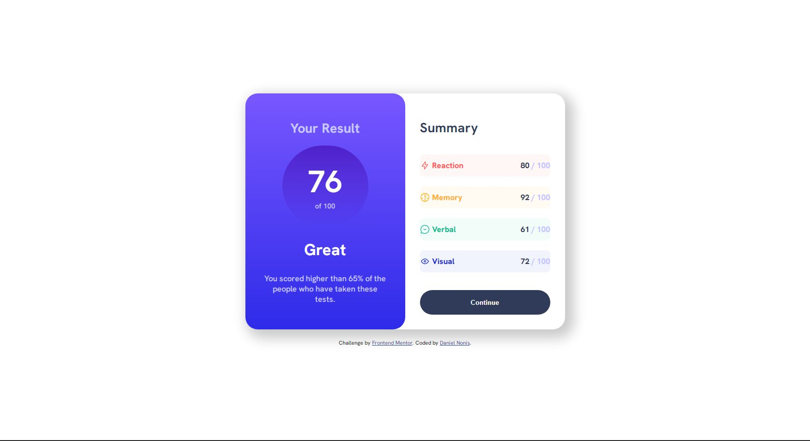

# Frontend Mentor - Results summary component solution

This is a solution to the [Results summary component challenge on Frontend Mentor](https://www.frontendmentor.io/challenges/results-summary-component-CE_K6s0maV). Frontend Mentor challenges help you improve your coding skills by building realistic projects. 

## Table of contents

- [Overview](#overview)
  - [The challenge](#the-challenge)
  - [Screenshot](#screenshot)
- [My process](#my-process)
  - [Built with](#built-with)
  - [What I learned](#what-i-learned)
  - [Continued development](#continued-development)
  - [Useful resources](#useful-resources)
- [Author](#author)


## Overview

### The challenge

Users should be able to:

- View the optimal layout for the interface depending on their device's screen size
- See hover and focus states for all interactive elements on the page
- **Bonus**: Use the local JSON data to dynamically populate the content

### Screenshot




### Links


## My process

I began as always with the container, then split it into two. The panel with the result was first, so I gave it a background with the gradient, then I gave everything the html semantic tags (which, I'll be honest, I didn't know what tag to give to what element) and wrapped the result numbers (in this case 76 of 100) into a ```<div>``` so I could make a circle with another ```<div>``` to make the numbers fit into it. 
The summary panel was a lot more difficult than I thought because at first I just made a ```<ul>``` with each parameter as an ```<li>```, so each list marker could be the icons provided, but I just could NOT figure out how to center the icons (both horizontally and vertically) so it looked very off. I then scrapped that idea and made a ```<div>``` that included every ```<p>``` element and then in the CSS file I used the :nth-of-type() property so I didn't have to give each ```<p>``` a unique class. Is what standard procedure or should I just give each ```<p>``` a unique class?. To get the numbers of each category all the way to the right I wrapped them in a ```<span>``` and aligned text to the right, then I wrapped the "/100" in another ```<span>``` to change the color.
Then I just resized and moved everything around for the mobile design. Which reminds me: it sometimes works and sometimes doesn't, like I load it in for the first time and it works so I save without touching anything else and then the day after I open it again and it's just... off. So as of uploading this the mobile version may not look wonky but I did not make any changes to it since I made it look good.

### Built with

- Semantic HTML5 markup
- CSS custom properties
- Flexbox
- CSS Grid

### What I learned

I haven't learned anything new per se, but I do feel a tighter grasp on at least the basic implementations of css and html.

```css
.proud-of-this-css {
  .percentages p:nth-of-type(1) {
  background-color: hsla(0, 100%, 67%, 0.05);
  color:hsl(0, 100%, 67%);
}

.percentages p:nth-of-type(2) {
  background-color: hsla(39, 100%, 56%, 0.05);
  color:hsl(39, 100%, 56%);
}

.percentages p:nth-of-type(3) {
  background-color: hsla(166, 100%, 37%, 0.05);
  color:hsl(166, 100%, 37%);
}

.percentages p:nth-of-type(4) {
  background-color: hsla(234, 85%, 45%, 0.05);
  color:hsl(234, 85%, 45%);
}
```

### Continued development

I'd love to know more about standard practices and things I should do or avoid! Specifically anything that helps me avoid repeating myself!

### Useful resources

- (https://www.w3schools.com) - Helped me with the pseudo class :nth-of-type().

## Author

- Frontend Mentor - [@Xarxytarsan](https://www.frontendmentor.io/profile/Xarxytarsan)


